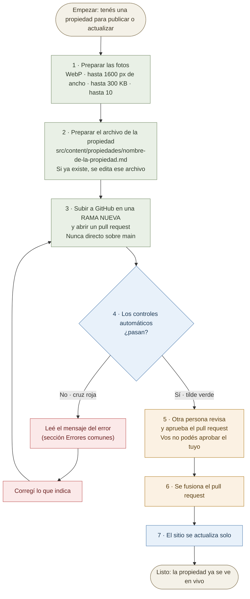

# Guía para publicar una propiedad en el sitio

Esta guía explica, paso a paso, cómo publicar una propiedad nueva en el sitio de
Damero Propiedades, y cómo actualizar una que ya esté publicada. Está pensada
para seguirse tal cual, sin conocimientos técnicos y sin instalar nada en tu
computadora: todo se hace desde el sitio web de GitHub.

Al terminar vas a tener la propiedad publicada: aparece en la lista de
`/propiedades` y tiene su propia página de detalle en `/propiedades/<slug>`.

> **Antes de tocar nada:** si un dato de la propiedad no lo tenés, **no lo
> inventes**. Preguntale al responsable. En este sitio está prohibido cargar
> datos inventados (precios, direcciones, fotos, cantidades). Si un valor no
> existe todavía, se deja un marcador explícito como `PENDIENTE`, nunca un dato
> que "suene bien".

---

## El recorrido, de un vistazo

Sea que publiques una propiedad **nueva** o que **actualices** una que ya existe, el camino es el
mismo. Preparás dos cosas (las fotos y el archivo de la propiedad), lo subís en una rama nueva con
un *pull request*, los controles automáticos revisan todo, una persona aprueba y el sitio se
actualiza solo. Si algo falla, se corrige y se vuelve a subir: por eso un error no puede romper el
sitio en vivo.



Los colores distinguen quién hace cada paso:

| Color | Quién actúa |
| --- | --- |
| Verde | Vos (lo hacés a mano) |
| Azul | El sistema (controles y publicación: corre solo) |
| Naranja | Otra persona (revisión y aprobación) |
| Rojo | Camino de corrección cuando un control falla |

---

## Qué necesitás antes de empezar

- **Acceso de colaborador con permiso de escritura** en el repositorio
  `FerEnoch/damero-propiedades-webpage-pre`
  (<https://github.com/FerEnoch/damero-propiedades-webpage-pre>). Si al entrar
  no podés editar archivos, pedile al responsable que te agregue como
  colaborador.
- **Los datos de la propiedad**: título, operación (venta o alquiler), precio,
  moneda, ambientes, ubicación, etc.
- **Las fotos ya preparadas**. Las fotos no se preparan acá: las entrega el
  fotógrafo o el diseñador (PRD §7). Vos solo las subís, tal como te llegaron.

No hace falta instalar Git ni usar la línea de comandos.

---

## Cómo se ve una propiedad en el sitio

Para entender qué datos completar, es útil saber qué muestra cada lugar:

- **En la lista** (`/propiedades`), cada propiedad aparece como una tarjeta con:
  la **primera foto** como portada, la etiqueta de operación (Venta o Alquiler),
  el **título**, el **precio con su moneda** y la línea **zona · localidad**.
- **En la página de detalle** (`/propiedades/<slug>`), se muestra en este orden:
  la galería de fotos, el título, el **resumen**, el bloque **DESCRIPCIÓN**, las
  **características**, el panel de **precio** (operación, habitaciones, cochera,
  moneda y expensas), la **ubicación** (zona · localidad) y el mapa aproximado
  de la zona.

---

## Parte 1 — Preparar las fotos

### Dónde van las fotos

Cada propiedad tiene **una carpeta propia** dentro de `public/propiedades/`, con
el nombre exacto del `slug` de la propiedad:

```
public/propiedades/<slug>/
```

Por ejemplo, si el `slug` de tu propiedad fuera `casa-ejemplo-3amb` (es un nombre de ejemplo,
ninguna propiedad real se llama así), la carpeta sería:

```
public/propiedades/casa-ejemplo-3amb/
```

### Los límites de las fotos (son obligatorios)

El sitio **no** convierte ni achica las fotos. Tienen que llegar ya en el
formato correcto. Por eso, cuando le pidas las fotos al fotógrafo o al
diseñador, pedile explícitamente que cumplan **todas** estas condiciones
(PRD §7 y §9, control 3):

| Regla | Valor |
| --- | --- |
| Cantidad máxima por propiedad | **10 fotos** |
| Formato | **WebP** (extensión `.webp`) |
| Ancho máximo | **1600 px** |
| Peso máximo por archivo | **hasta 300 KB** |

Si una foto no cumple, el sitio no la va a aceptar y la publicación va a
quedar detenida (ver *Errores comunes*). La revisión la hace el sitio
automáticamente; no hay que hacer nada especial, solo respetar los límites.

### La portada es siempre la primera foto

No existe ningún campo para "marcar" una portada. La regla es una sola:

> **La portada es siempre la primera foto de la lista.**

Por eso, cuando armes la lista de fotos, poné **primero** la que querés que
aparezca como portada en la lista y como foto grande en el detalle.

---

## Parte 2 — Crear el archivo de la propiedad

### Dónde va el archivo

Cada propiedad es **un archivo de texto** (extensión `.md`) dentro de:

```
src/content/propiedades/
```

Por conveniencia, el archivo se llama igual que el `slug`:

```
src/content/propiedades/<slug>.md
```

### Cómo está armado el archivo

El archivo tiene dos partes:

1. **Arriba**, entre la primera línea `---` y la segunda línea `---`, van los
   **campos estructurados** (el "frontmatter"). Es la ficha de la propiedad.
2. **Abajo** de la segunda línea `---`, va el **texto libre** de la
   descripción. Es lo que se muestra en el bloque **DESCRIPCIÓN** de la página
   de detalle.

### Los campos del frontmatter

Todos los campos son **obligatorios**, salvo los dos que dicen "(opcional)".

| Campo | Qué es | Cómo se escribe |
| --- | --- | --- |
| `titulo` | El título de la propiedad, el que se ve como encabezado. | Texto entre comillas. |
| `descripcion` | Un **resumen corto** de una o dos líneas. | Texto entre comillas. |
| `slug` | El identificador de la propiedad en la dirección web. Único. | Minúsculas, con guiones, sin espacios, sin acentos ni `ñ`. Ej.: `casa-ejemplo-3amb`. |
| `operacion` | Si la propiedad es para vender o para alquilar. | Solo `"venta"` o `"alquiler"`. |
| `tipo` | El tipo de propiedad. | Texto. Ej.: `"casa"`, `"departamento"`, `"lote"`. |
| `precio` | El precio. | Número, **sin comillas y sin puntos de miles**. Ej.: `95000`, no `"95.000"`. |
| `moneda` | La moneda del precio. | Solo `"USD"` o `"ARS"`. |
| `habitaciones` | Cantidad de ambientes. | Número. Si no aplica (ej.: un lote), se pone `0`. |
| `cochera` | Si tiene cochera. | `true` (sí) o `false` (no). También admite un número. |
| `caracteristicas` | Lista de características. | Lista entre corchetes, con palabras con guiones. Ej.: `["patio", "parrilla"]`. |
| `zona` | La zona, escrita como texto libre. | Texto entre comillas. Ej.: `"Zona quintas, camino rural km 12"`. |
| `localidad` | La localidad. | Texto entre comillas. Ej.: `"Luján"`. |
| `map_lat` | Latitud del centro **aproximado** de la zona. | Número. Ver la nota del mapa. |
| `map_lon` | Longitud del centro **aproximado** de la zona. | Número. Ver la nota del mapa. |
| `whatsapp` | El número de WhatsApp del agente para esta propiedad. | Texto entre comillas. No inventes un número (ver abajo). |
| `fotos` | La lista de fotos (ver Parte 3). | Lista. Puede quedar vacía: `[]`. |
| `expensas` | **(opcional)** Expensas mensuales, solo si aplica. | Número. Si no aplica, se **omite** el campo. |
| `destacada` | **(opcional)** Si aparece destacada en la página de inicio. | `true` o `false`. Si no se pone, es `false`. |

Notas importantes:

- **No agregues campos que no estén en esta lista.** El archivo solo admite
  exactamente estos campos; un campo de más (o mal escrito) hace fallar la
  publicación.
- **`map_lat` y `map_lon` son un centro aproximado, con desfase a propósito.**
  No se muestran nunca como números: solo se usan para dibujar un círculo
  aproximado de la zona. Nunca pongas la ubicación exacta de la propiedad.
- **`whatsapp`**: mientras el responsable no entregue el número real, dejá el
  mismo valor de relleno que usan las propiedades existentes
  (`"+54 9 2304 000000"`). No inventes un número real.

### `descripcion` y el texto de abajo: no son lo mismo

Son dos textos distintos y **no hay que repetir el mismo contenido en los dos**:

- **`descripcion`** (en el frontmatter) es el **resumen corto**. Se muestra como
  una línea destacada justo debajo del título, arriba de todo. Pensalo como el
  "titular" que resume la propiedad en una o dos frases.
- **El texto de abajo** (debajo de la segunda línea `---`) es la **descripción
  larga**. Se muestra dentro del bloque **DESCRIPCIÓN** y puede tener varios
  párrafos.

### Ejemplo para copiar

El modelo de abajo está basado en una propiedad que **sí está** en el sitio
(`src/content/propiedades/casa-3-amb-guadalupe-santa-fe.md`): los datos y las fotos son los de esa
propiedad real. Copialo y reemplazá cada valor por los de tu propiedad:

```markdown
---
titulo: "Casa 3 ambientes con patio en Guadalupe"
descripcion: "Casa de 3 ambientes con patio y cochera en barrio Guadalupe, Santa Fe."
slug: "casa-3-amb-guadalupe-santa-fe"
operacion: "venta"
tipo: "casa"
precio: 118000
moneda: "USD"
habitaciones: 3
cochera: true
caracteristicas: ["patio", "parrilla"]
zona: "Guadalupe"
localidad: "Santa Fe"
# Centro aproximado de la zona, con un desfase a propósito. Nunca se muestran como números.
map_lat: -31.6375
map_lon: -60.6873
# Número de WhatsApp de relleno mientras no exista el real. No inventes uno.
whatsapp: "+54 9 2304 000000"
fotos:
  - src: "/propiedades/casa-3-amb-guadalupe-santa-fe/01-fachada.webp"
    titulo: "Fachada"
  - src: "/propiedades/casa-3-amb-guadalupe-santa-fe/02-living-comedor.webp"
    titulo: "Living-comedor"
  - src: "/propiedades/casa-3-amb-guadalupe-santa-fe/03-cocina.webp"
    titulo: "Cocina"
  - src: "/propiedades/casa-3-amb-guadalupe-santa-fe/04-dormitorio.webp"
    titulo: "Dormitorio"
  - src: "/propiedades/casa-3-amb-guadalupe-santa-fe/05-patio.webp"
    titulo: "Patio"
destacada: true
---

La propiedad se ubica en barrio Guadalupe, Santa Fe. Cuenta con patio, parrilla y cochera.
```

En ese ejemplo:

- El **resumen** es "Casa de 3 ambientes con patio y cochera en barrio
  Guadalupe, Santa Fe." (el campo `descripcion`).
- La **descripción larga** es "La propiedad se ubica en barrio Guadalupe,
  Santa Fe. Cuenta con patio, parrilla y cochera." (el texto de abajo).

> Las líneas que empiezan con `#` (como los comentarios del archivo original)
> son notas para quien lee el archivo y no afectan el resultado.

---

## Parte 3 — Subir las fotos

Las fotos se suben a la carpeta de la propiedad, y después se **enlazan** desde
el campo `fotos` del archivo.

### Paso 3.1 — Enlazar las fotos en el archivo

En el frontmatter, completá el campo `fotos` con una entrada por foto. Cada
entrada lleva el campo `src` (obligatorio) y puede llevar un `titulo`
(opcional):

```yaml
fotos:
  - src: "/propiedades/<slug>/<nombre-de-la-foto-1>.webp"
    titulo: "Frente de la casa"
  - src: "/propiedades/<slug>/<nombre-de-la-foto-2>.webp"
    titulo: "Patio"
```

Reglas de esta lista:

- La ruta `src` **siempre empieza con `/propiedades/`** (sin `public`), sigue
  con el `slug` de la propiedad y termina con el nombre del archivo `.webp`.
  Los nombres de la ruta deben coincidir **exactamente** con la carpeta y los
  archivos que subas.
- **El orden importa:** la primera entrada es la portada.
- El `titulo` de cada foto es opcional. Sirve como descripción de la imagen
  para lectores de pantalla. No es un texto que se vea en la página.
- Cada foto admite también un campo `descripcion` opcional, pero **todavía no
  se muestra en ninguna parte del sitio**. No lo uses esperando que aparezca.
- Si la propiedad no tiene fotos, dejá `fotos: []`. El sitio muestra entonces
  una imagen de marca en lugar de la foto, y la página funciona igual.
- Nunca referencies una foto que no exista: si el archivo no está subido, la
  publicación se detiene con el error `file does not exist under public/`.

### Paso 3.2 — Subir los archivos

Subí las fotos a `public/propiedades/<slug>/` (la carpeta que crea el `slug`).
Los nombres de los archivos tienen que ser exactamente los que pusiste en cada
`src`. En *Parte 4* está el detalle de cómo hacerlo desde GitHub.

---

## Parte 4 — Publicar el cambio

Todo se hace desde el sitio web de GitHub, con tu usuario de colaborador.

> **Importante:** no se publica directo sobre la rama `main`. Se crea una rama
> nueva y un "pull request" (una propuesta de cambio). Así el sitio revisa
> automáticamente lo que subiste antes de que se publique. Es la red de
> seguridad, no un castigo.

### Paso 4.1 — Subir las fotos y crear la rama

1. Entrá al repositorio:
   <https://github.com/FerEnoch/damero-propiedades-webpage-pre>
2. Navegá hasta la carpeta `public/propiedades/`.
3. Hacé clic en **Add file** → **Upload files**.
4. Arrastrá una carpeta llamada exactamente como el `slug` de la propiedad
   (por ejemplo `casa-ejemplo-3amb`), con las fotos adentro. GitHub conserva el
   nombre de la carpeta.
5. Abajo de todo, en la sección **Commit changes**, aparece la elección de
   rama. Elegí la opción:

   > **Create a new branch for this commit and start a pull request**

   (Debajo dice *Learn more about branches*. Es un botón de opción: hay que
   marcar ese, no el que dice *Commit directly to the `main` branch*.)
6. GitHub propone un nombre de rama. Podés aceptarlo o escribir uno más claro,
   por ejemplo `propiedad-casa-ejemplo-3amb`.
7. Confirmá con el botón verde. GitHub crea la rama y abre el pull request.

> Si las fotos todavía no están listas, podés subirlas después. Lo importante es
> que **las fotos y el archivo de la propiedad terminen en la misma rama** antes
> de la revisión.

### Paso 4.2 — Crear el archivo de la propiedad en la misma rama

1. Volvé a la pestaña **Code** del repositorio y, en el selector de ramas (arriba
   a la izquierda, donde normalmente dice `main`), elegí la rama que creaste.
2. Navegá hasta `src/content/propiedades/`.
3. Hacé clic en **Add file** → **Create new file**.
4. En el nombre del archivo escribí `<slug>.md` (por ejemplo
   `casa-ejemplo-3amb.md`) y pegá el contenido que armaste en la Parte 2.
5. Abajo de todo, confirmá el cambio. Como ya estás sobre la rama nueva, este
   cambio se suma al mismo pull request.

El pull request se actualiza solo con cada cambio que subís a esa rama.

### Paso 4.3 — Esperar los controles automáticos

Cuando el pull request tiene cambios, GitHub ejecuta automáticamente los
controles del sitio (la "aceptación"). Van a aparecer como una lista de tareas
en el pull request:

- **Si todo pasa:** vas a ver una tilde verde. El cambio queda listo para que
  alguien lo revise y lo fusione. Cuando se fusione, el sitio se actualiza.
- **Si algo falla:** vas a ver una cruz roja y el cambio **no se publica**. Eso
  es lo que queremos: evita que un error llegue al sitio en vivo. Leé el mensaje
  (ver *Errores comunes*), corregí lo que indica y subí el cambio de nuevo. El
  pull request se vuelve a revisar solo.

Cuando los controles estén en verde, el pull request **queda esperando la aprobación de otra
persona**. Vos no podés aprobar ni fusionar tu propio pull request: está configurado así a
propósito en el repositorio. Cuando alguien lo apruebe y lo fusione, el sitio se actualiza solo.

---

## Actualizar una propiedad que ya existe

El recorrido es **exactamente el mismo** que el de publicar una nueva (rama nueva, *pull request*,
controles, aprobación, fusión). Cambian sólo los dos primeros pasos:

- **El archivo no se crea: se edita.** Abrí `src/content/propiedades/<slug>.md` con el botón de
  lápiz (*Edit this file*), cambiá lo que haga falta y guardá. Ese cambio se suma al *pull request*.
- **Las fotos que ya están no se vuelven a subir.** Si querés sumar fotos, subí **sólo los archivos
  nuevos** a `public/propiedades/<slug>/` y agregá sus entradas al campo `fotos`, en el lugar que
  corresponda al orden: la primera entrada sigue siendo la portada.

Dos advertencias importantes:

- **No cambies el `slug`.** Es la dirección web de la propiedad: si lo cambiás, la dirección vieja
  deja de funcionar y se rompen los enlaces que ya se hayan compartido.
- **No dejes fotos sueltas sin usar.** Si sacás una foto de la lista, borrá también el archivo de
  `public/propiedades/<slug>/`: el control de imágenes revisa **todos** los archivos de esa carpeta,
  aunque ninguna propiedad los referencie, y un archivo que se pasa de peso frena la publicación
  (ver *Errores comunes*).

---

## Errores comunes y cómo leerlos

### Errores del archivo de la propiedad

Si falta un campo, está mal escrito o tiene un valor que no corresponde, el
control falla y **nombra el campo con problema**. Los casos más habituales:

- **Falta un campo obligatorio.** Todos los campos de la tabla son obligatorios
  salvo `expensas` y `destacada`. Si falta, por ejemplo, `precio`, el error
  menciona `precio`.
- **Un campo mal escrito o de más.** El archivo solo admite los campos de la
  tabla. Un campo como `precios` (en plural) o `direccion` no existe y hace
  fallar la publicación con un mensaje que dice que la clave no es reconocida.
- **Un valor con el formato equivocado.** Por ejemplo:
  - `precio: "95.000"` (texto con puntos) en lugar de `precio: 95000` (número).
  - `moneda: "pesos"` en lugar de `"ARS"` o `"USD"`.
  - `operacion: "vender"` en lugar de `"venta"` o `"alquiler"`.
- **El archivo no empieza o no cierra el frontmatter.** El archivo tiene que
  empezar con `---` en la primera línea y cerrar esa sección con otra línea
  `---`. Si no, el control avisa que el frontmatter no abre o no se cierra.
- **Dos propiedades con el mismo `slug`.** El `slug` tiene que ser único. Si se
  repite, las dos páginas chocan en la misma dirección y la publicación falla.

### Errores de las fotos (límites de imágenes)

Este control revisa que cada foto cumpla los límites de la Parte 1. Cuando algo
no cumple, el mensaje del control se ve así (estos son los formatos exactos,
con la propiedad de ejemplo):

```
Image limit violations (PRD §9 check 3):

  - <mensaje de cada problema>

N violation(s). Limits: <= 10 photos per listing, .webp, width <= 1600px, each file <= 300 KB.
```

Ejemplos reales de cada mensaje:

- **Demasiadas fotos:**

  ```
  casa-ejemplo-3amb.md: 12 photos referenced, the limit is 10
  ```

- **Una foto pesa de más:**

  ```
  /propiedades/casa-ejemplo-3amb/frente.webp (referenced by casa-ejemplo-3amb.md): 480 KB exceeds the 300 KB limit
  ```

- **La foto no es WebP:**

  ```
  /propiedades/casa-ejemplo-3amb/frente.jpg (referenced by casa-ejemplo-3amb.md): must be .webp, found ".jpg"
  ```

- **La foto es demasiado ancha:**

  ```
  /propiedades/casa-ejemplo-3amb/frente.webp (referenced by casa-ejemplo-3amb.md): width 2400px exceeds the 1600px limit
  ```

- **La foto referenciada no está subida:**

  ```
  /propiedades/casa-ejemplo-3amb/frente.webp (referenced by casa-ejemplo-3amb.md): file does not exist under public/
  ```

- **La foto está en la carpeta de otra propiedad, o fuera de `propiedades/`:**
  La ruta `src` tiene que empezar con `/propiedades/<slug>/`, con el `slug` de
  *esa* propiedad. Es el error típico de copiar el `src` de otra propiedad y
  olvidarse de cambiar la carpeta:

  ```
  /propiedades/otra-propiedad/frente.webp (referenced by casa-ejemplo-3amb.md): must live under /propiedades/casa-ejemplo-3amb/ — the guide requires the listing's own slug folder
  ```

- **El archivo dice ser WebP pero no es válido:**

  ```
  /propiedades/casa-ejemplo-3amb/frente.webp (referenced by casa-ejemplo-3amb.md): unrecognisable WebP header — the file is not a valid WebP
  ```

- **Una foto subida que no está enlazada en ninguna propiedad.** También se
  revisa: aunque no se use, si pesa de más o no es WebP, falla. En ese caso el
  mensaje dice `in public/propiedades/`:

  ```
  /propiedades/casa-ejemplo-3amb/otra.webp (in public/propiedades/): 512 KB exceeds the 300 KB limit
  ```

- **La ruta `src` intenta salir de `public/`.** Caso raro: solo pasa si la ruta
  lleva `..`. Se rechaza por seguridad:

  ```
  /propiedades/casa-ejemplo-3amb/../../../../etc/hosts (referenced by casa-ejemplo-3amb.md): resolves outside public/
  ```

Cuando los límites están bien, el control muestra una línea como esta (los números cambian con
cada carga; estos son los del sitio al momento de escribir esta guía):

```
Image limits OK — 4 listing(s), 19 referenced photo(s), 19 file(s) under public/propiedades/.
```

---

## Lista de control final

Antes de dar por publicada la propiedad, confirmá:

- [ ] El archivo está en `src/content/propiedades/<slug>.md`.
- [ ] El archivo empieza con `---` y cierra el frontmatter con `---`.
- [ ] Están todos los campos obligatorios; `expensas` y `destacada` son los
      únicos opcionales.
- [ ] El `precio` es un número (sin comillas ni puntos) y `moneda` es `"USD"` o
      `"ARS"`.
- [ ] `operacion` es `"venta"` o `"alquiler"`.
- [ ] El `slug` no se repite con otra propiedad.
- [ ] La **primera foto** de la lista `fotos` es la que querés de portada.
- [ ] Las fotos están en `public/propiedades/<slug>/` y coinciden exactamente
      con las rutas `src`.
- [ ] Hay **10 fotos o menos**; todas son `.webp`, de **1600 px de ancho o
      menos** y pesan **hasta 300 KB**.
- [ ] El cambio se subió en una **rama nueva** con un pull request, no directo
      a `main`.
- [ ] Los controles automáticos del pull request están en **verde** y otra persona lo aprobó.
